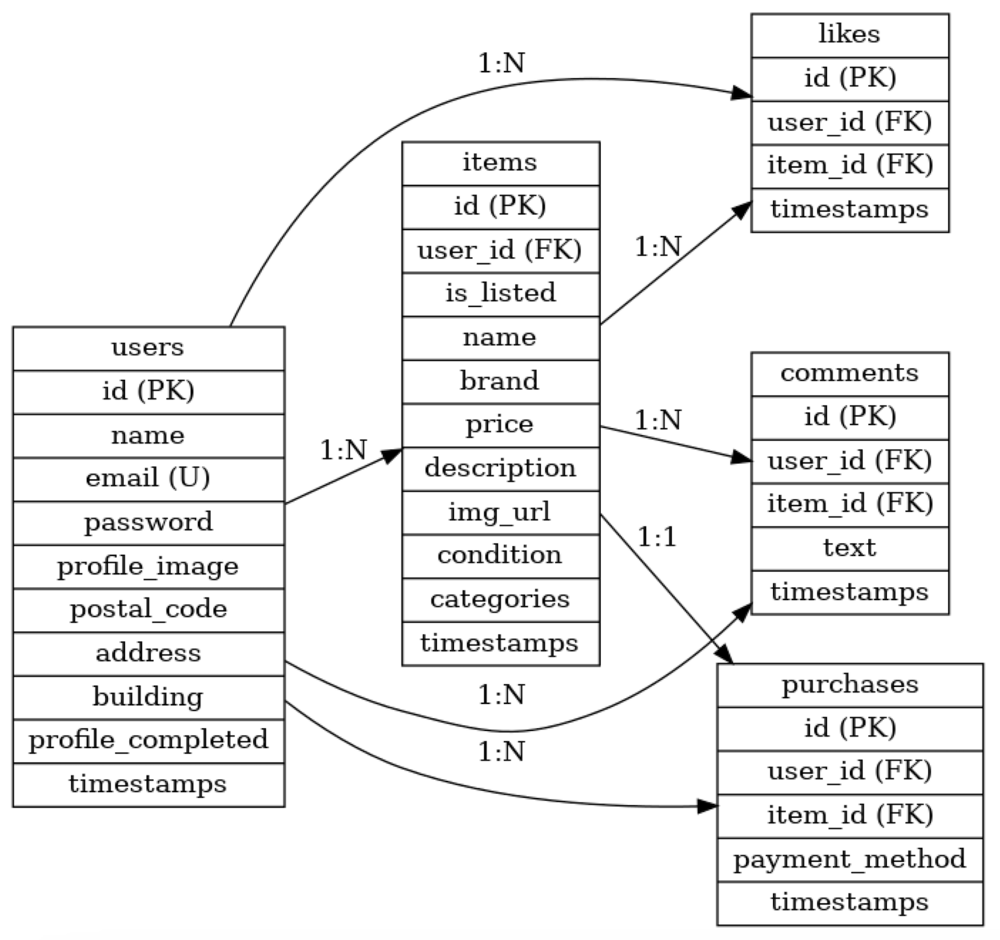

# beginner-laravel

登録したユーザーが、商品を出品。購入できる Web アプリケーションです。

---

## 環境構築

以下の手順でローカル環境を構築できます。

```bash
# リポジトリをクローン
git clone https://github.com/KOUSEI-dot/beginner-laravel.git
cd beginner-laravel

docker-compose up --build
⇨一度ターミナルを閉じる。

cd beginner-laravel

docker-compose exec php bash


# パッケージインストール
composer install || composer update

exit

cd src


npm install

# フロントエンドアセットをビルド（ 開発用ビルド）
npm run dev   # 開発環境向け

# .env 設定
cp .env.example .env
php artisan key:generate


```

隠しファイルの.env を以下のように書き換える。⇩

DB_CONNECTION=mysql
DB_HOST=mysql
DB_PORT=3306
DB_DATABASE=laravel_db
DB_USERNAME=laravel_user
DB_PASSWORD=laravel_pass

## 使用技術（実行環境）

- **Laravel 8.x**
  - `composer.json` の `"laravel/framework": "^8.75"` より
- **PHP 7.3 〜 8.x 対応**
  - `"php": "^7.3|^8.0"` より
- **MySQL**
  - `.env` にて `DB_CONNECTION=mysql` が設定されているため
- **Laravel Fortify**（認証機能）
  - `"laravel/fortify": "^1.19"` より
- **Laravel Sanctum**（API トークン認証に対応可能）
  - `"laravel/sanctum": "^2.11"` より
- **Guzzle HTTP Client**（API 通信）
  - `"guzzlehttp/guzzle": "^7.0.1"` より
- **CORS 対応**
  - `"fruitcake/laravel-cors": "^2.0"` によりクロスオリジン通信の設定が可能
- **Tinker**（REPL 環境）
  - `php artisan tinker` でテスト・DB 操作が可能
- **Laravel Sail**（ローカル開発用の Docker 環境オプション）
  - `"laravel/sail": "^1.0.1"` は Docker 環境での開発もサポート
- **テスト環境**
  - PHPUnit（`^9.5.10`）、Mockery、Faker を使用してテストが可能
- **ローカル開発用 SMTP メール環境**
  - `.env` に `MAIL_HOST=mailhog` とあり、MailHog を使用したテストメール送信に対応
- **Redis（オプション）**
  - `.env` に Redis の記載があり、キューやキャッシュでの利用を想定

## ER 図



## URL

・開発環境：：http://localhost
・phpMyadmin:http://localhost:8000

# beginner-laravel
